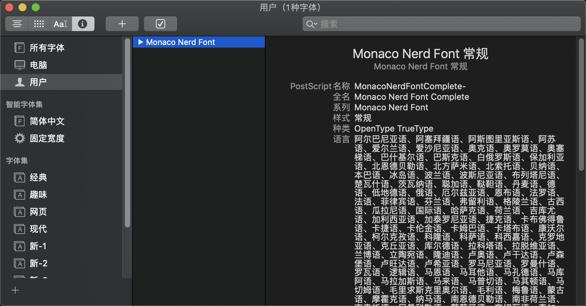
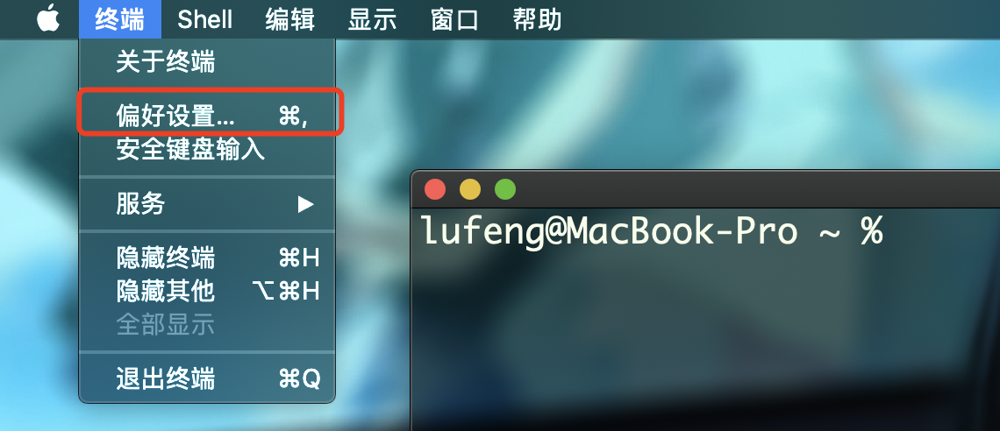
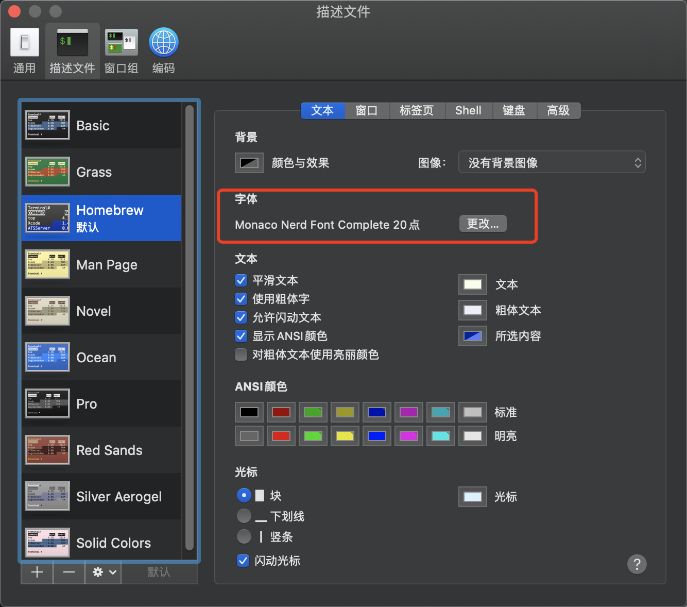
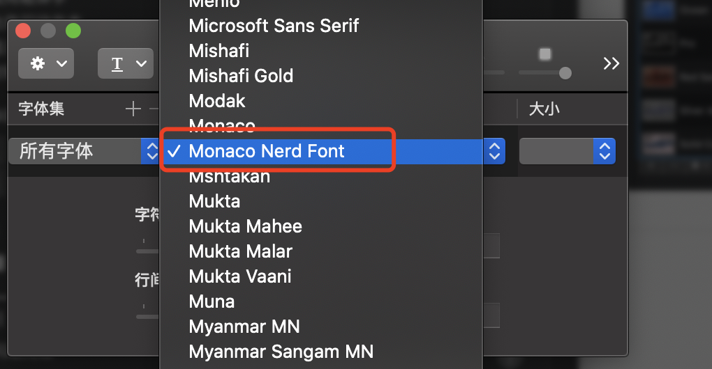
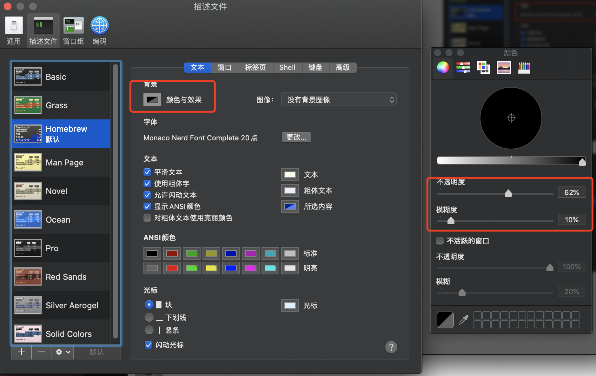
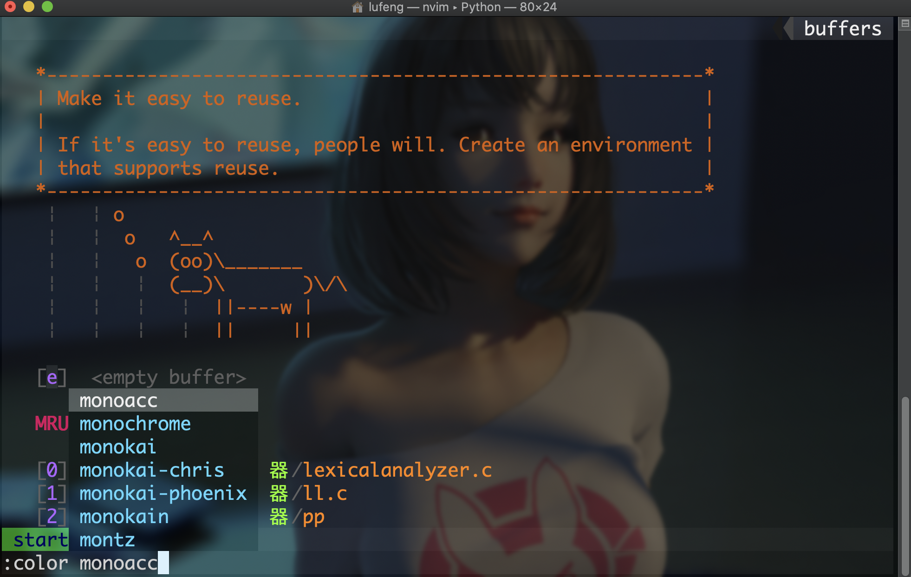

# iVimmer

你知道的，为了效率......

在你的 Mac 上搭建一个更好的Vim编辑器！ 

感谢[黄老板](https://github.com/devilyouwei)的[原始版本](https://github.com/devilyouwei/NVimmer)（Linux 版）和大力支持。

[English Readme](README_EN.md)

## 适用的语言

1.  HTML CSS JS **[eslint]**
2.  Java **[color enhanced]**
3.  C# **[enhanced]**
4.  vue
5.  TypeScript
6.  PHP
7.  C/C++ [增强]
8.  Markdown
9.  JSON
10. Wechat wxml
11. react js/jsx/tsx **[new]**
12. Kotlin **[weakly support]**
13. 英语单词 1000 多自动补全 **[new]**
14. Emoji 表情补全 (输入`:`后自动弹出) **[new]**

注：所有的现代前端框架的代码 format 和 lint 默认是 **prettier+eslint**！

## 开始之前

（测试版本为 macOS Catalina 10.15.5）

1.保证你能科学上网。

2.更新 brew:

```bash
brew update
```

3.安装 wget:

```bash
brew install wget
```

4.某些语言的支持可能需要 root 权限，不需要的可以跳过。

## Mac 自动安装脚本 ✈️✈️✈️

```bash
sh mac_install.sh
```

## Mac 手动安装 🔨🔨🔨

### 获取配置文件

我这边采用 wget 下载原始版本（Linux 版）的配置文件到本地，采用其他下载方式亦可，只需要放到 Mac 下对应的文件夹。

```bash
# vim-plug
curl -fLo ~/.local/share/nvim/site/autoload/plug.vim --create-dirs \
    https://raw.githubusercontent.com/junegunn/vim-plug/master/plug.vim

# nerd monaco font
wget -P ~/Library/Fonts/ https://github.com/devilyouwei/linux-font/raw/master/Monaco/Nerd/YaheiMonacoNerd.ttf

wget -P ~/.config/nvim/ https://raw.githubusercontent.com/devilyouwei/iVimmer/master/coc-settings.json

wget -P ~/.config/nvim/ https://raw.githubusercontent.com/devilyouwei/iVimmer/master/init.vim
```

### 安装 Neovim

```bash
brew install neovim
```

### 安装 Node.js 和 npm

```bash
brew install node
brew install npm
```

### 插件安装

1.JavaScript

```bash
npm install -g neovim
npm install -g eslint
```

2.Ruby 需要 sudo

```bash
sudo gem install neovim
```

3.Perl 需要 sudo

```bash
sudo brew install cpanminus
cpanm Neovim::Ext
```

4.Python

```bash
pip install neovim  #python2
pip3 install neovim #python3
```

5.C/C++

```bash
brew install llvm
brew install ccls
```

6.其他

```bash
brew install ctags
brew install astyle
brew install clang-format
brew install shfmt
brew install lazygit
```

Nvim 安装插件并自动退出

```bash
nvim -c PlugInstall -c q -c q
```

## 字体，zsh 外观，主题 💃💃💃

1.字体安装及使用基于 MonacoNerd 的自制字体，可以显示定制符号。

```bash
wget -P ~/Library/Fonts/ https://github.com/devilyouwei/NVimmer/raw/master/fonts/linux/MonacoNerd.ttf
```

确认用户中有了 Monaco Nerd Font： 

进入终端偏好设置，并选择 Monaco Nerd Font 字体：  


2.zsh 外观设置 zsh 透明度： 

3.nvim 主题选择采用[vim-colorschemes](https://github.com/flazz/vim-colorschemes)插件设置 nvim 主题。可前往该插件查看主题
名称或 tab 自动补全

```
:color monokai-phoenix
```


